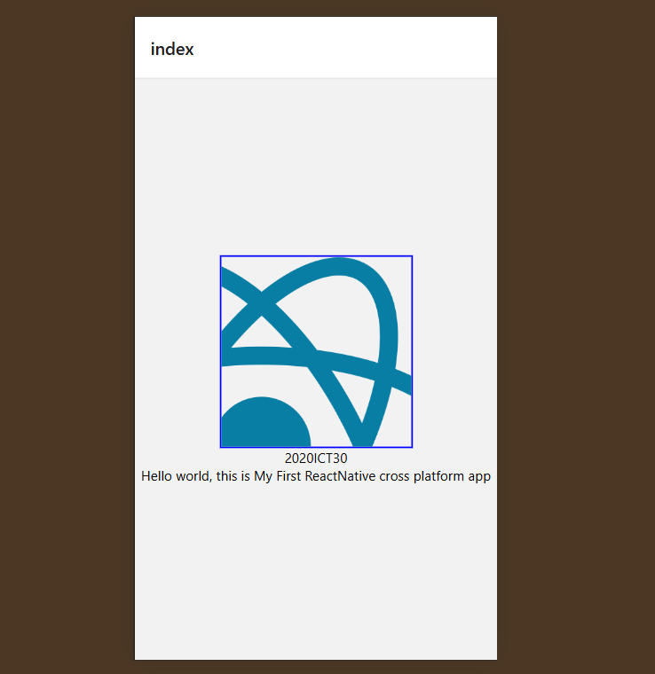

<h1>2020/ICT/30</h1>

Practicals overview:- We are creating simple react Native webpage using Text,View,Image,StyleSheet

For that we are using following commands

Create app:- npx create-expo-app@latest myapp   
    change directory:- cd myapp  
    Reset Project Script:- npm run reset-project   
    Run the app on Mobile and the web:- npx expo start
  

<h2>Output</h2>

